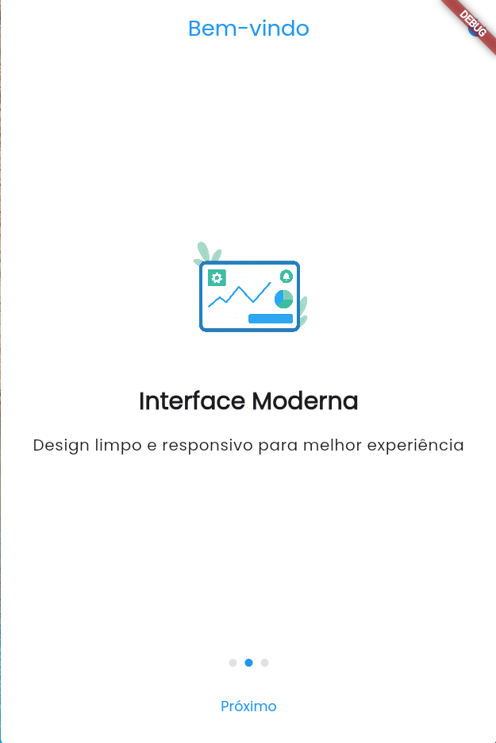
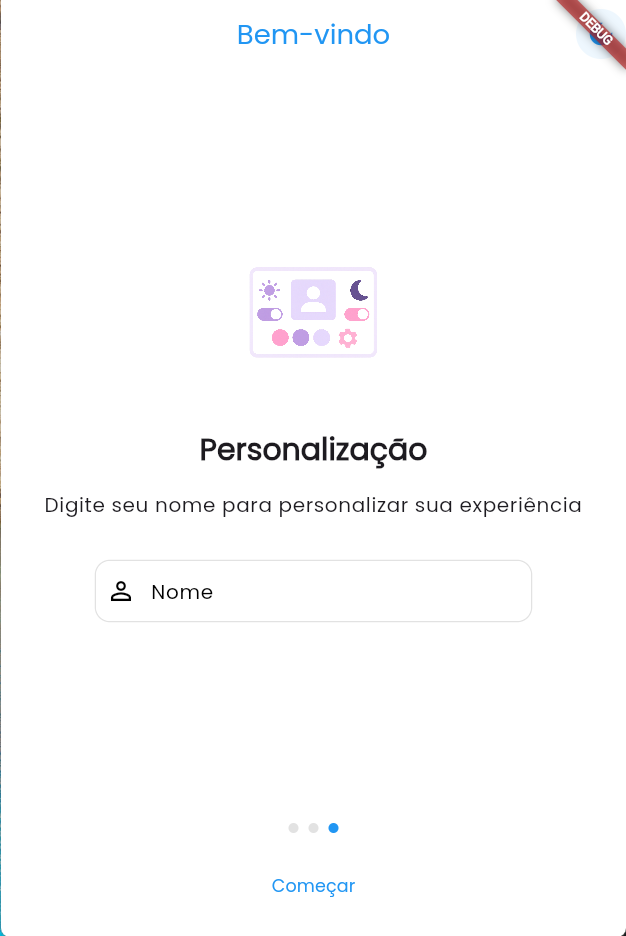
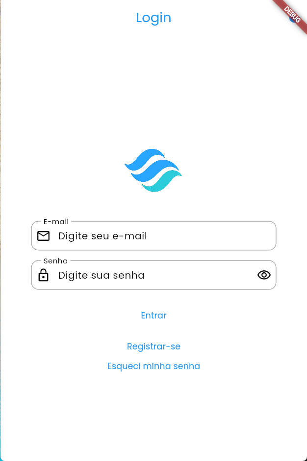
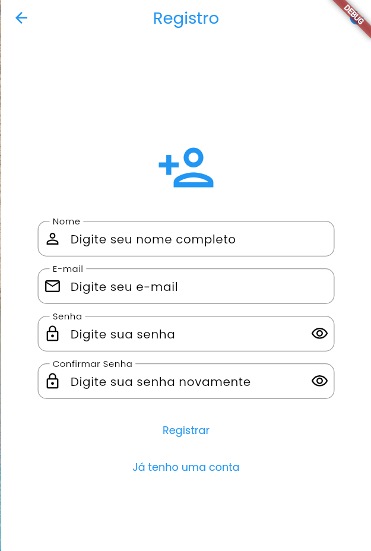

# FlowLogin

Um aplicativo Flutter moderno com splash screen animada, onboarding informativo, tela de login funcional e suporte a temas claro/escuro.

## 🎥 Demonstração
<div style="display: flex; justify-content: center;">
  
</div>

## Funcionalidades

- Splash Screen nativa e animada com rotação da logo
- Onboarding com 3 telas informativas
- Campo de nome animado no onboarding
- Tela de login com validação
- Suporte a temas claro e escuro
- Widgets customizados reutilizáveis
- Interface moderna e responsiva

## Pacotes Utilizados

- flutter_native_splash: ^2.3.10
- shared_preferences: ^2.2.2
- lottie: ^2.7.0
- google_fonts: ^6.1.0
- flutter_svg: ^2.0.9
- provider: ^6.1.1

## Estrutura do Projeto

```
/lib
  /features
    /splash
      - splash_screen.dart
    /onboarding
      - onboarding_screen.dart
    /login
      - login_screen.dart
    /home
      - home_screen.dart
  /shared
    /widgets
      - login_text_form_field.dart
      - animated_name_field.dart
    /controllers
      - theme_controller.dart
    /themes
      - light_theme.dart
      - dark_theme.dart
  main.dart
```

## Widgets Customizados

### LoginTextFormField
Campo de texto customizado para login com:
- Animação de escala ao focar
- Validação integrada
- Suporte a ícones prefixo/sufixo
- Feedback visual de foco


### AnimatedNameField
Campo de nome animado para onboarding com:
- Animação de borda
- Feedback visual de validação
- Ícone de check animado
- Sombra dinâmica

## Como Executar

1. Clone o repositório
2. Execute `flutter pub get` para instalar as dependências
3. Execute `flutter pub run flutter_native_splash:create` para gerar a splash screen nativa
4. Execute `flutter run` para iniciar o aplicativo

## Fluxo da Aplicação

1. Splash Screen Nativa
2. Splash Screen Animada
3. Onboarding (3 telas)
4. Tela de Login
5. Tela Inicial

## 🖼️ Screenshots
<div align="left">
  
  
  
</div>
<div align="left">
  
  
  
  
</div>

## Diferenciais

- Splash Screen com rotação da logo
- Onboarding com campo de nome animado
- Interface moderna e intuitiva
- Transições suaves entre telas
- Temas claro/escuro com persistência
